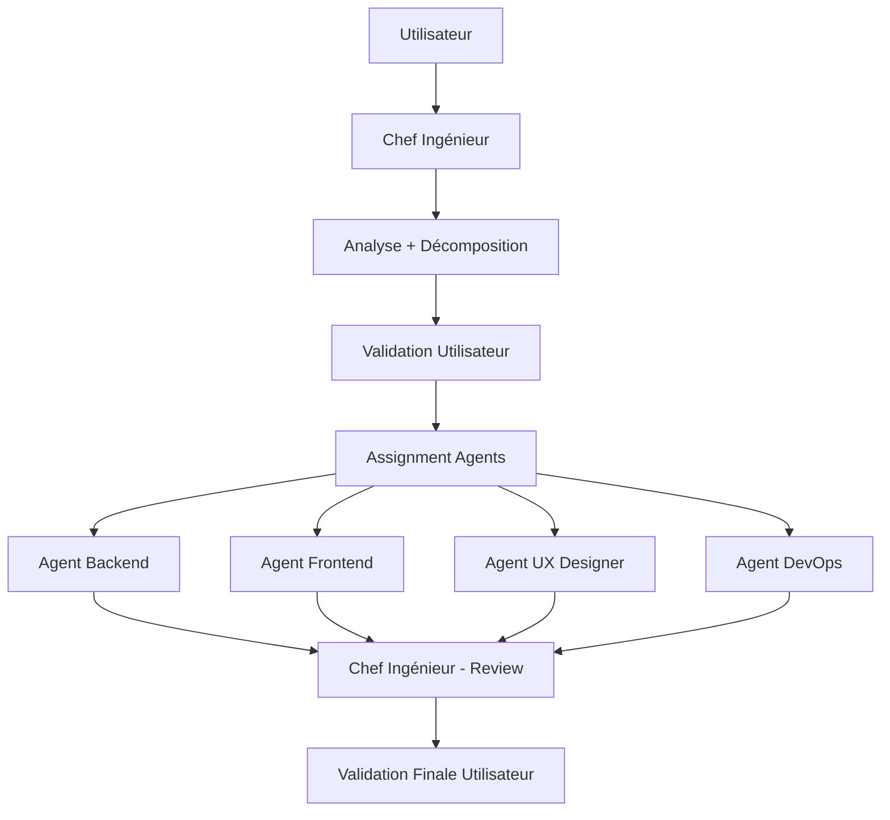

# 🚀 SYSTÈME D'AGENTS - Rails Challenge

## 🏗️ ARCHITECTURE D'ÉQUIPE

### 👨‍💼 Chef Ingénieur (Agent Principal)
- **Rôle**: Orchestrateur et interface utilisateur unique
- **Fichier**: `.cursor-agents/chef-ingenieur-rules.md`
- **Responsabilité**: Validation, décomposition, coordination

### 🔧 Agent Backend  
- **Rôle**: Models, Controllers, Database, API
- **Fichier**: `.cursor-agents/backend-agent-rules.md`
- **Spécialité**: Rails backend et logique métier

### 🎨 Agent Frontend
- **Rôle**: Views, JavaScript, CSS, UX interface
- **Fichier**: `.cursor-agents/frontend-agent-rules.md`  
- **Spécialité**: Templates ERB, Stimulus, Bootstrap

### 🎯 Agent UX Designer
- **Rôle**: Interface, Ergonomie, Accessibilité
- **Fichier**: `.cursor-agents/ux-designer-agent-rules.md`
- **Spécialité**: User flows, wireframes, design

### 🚀 Agent DevOps
- **Rôle**: Déploiement, Configuration, Performance  
- **Fichier**: `.cursor-agents/devops-agent-rules.md`
- **Spécialité**: Heroku, environments, monitoring

## 🔄 WORKFLOW OBLIGATOIRE



## ⚠️ RÈGLES CRITIQUES

### Pour le Chef Ingénieur
- **JAMAIS** procéder sans validation utilisateur
- **TOUJOURS** montrer l'analyse et décomposition
- **OBLIGATOIRE** partir du contexte réel du projet

### Pour les Agents Spécialisés  
- **Respecter** leur domaine de responsabilité
- **Suivre** les standards Rails du projet
- **Appliquer** DRY et simplicité
- **Documenter** les décisions importantes

## 🎯 EXEMPLE D'UTILISATION

### Demande Utilisateur
> "Je veux ajouter une fonctionnalité de commentaires aux challenges"

### Réponse Chef Ingénieur
```markdown
## 📊 ANALYSE DE LA DEMANDE
Ajouter système de commentaires associés aux challenges existants

## 🔍 CONTEXTE ACTUEL VÉRIFIÉ
- Model Challenge existant avec User association
- ChallengesController avec actions CRUD
- Pundit policies en place
- Bootstrap design system établi

## 📝 DÉCOMPOSITION DES TÂCHES  
1. **Backend**: Créer model Comment + associations + migrations → Agent Backend
2. **Backend**: Ajouter actions comments dans controller → Agent Backend  
3. **Frontend**: Templates pour affichage/ajout commentaires → Agent Frontend
4. **UX**: Flow interaction commentaires et modération → Agent UX Designer
5. **DevOps**: Migration déploiement staging/prod → Agent DevOps

## ✋ VALIDATION REQUISE
Confirmez-vous cette analyse et décomposition avant que je procède ?
```

## 🚀 ACTIVATION

Pour utiliser ce système:

1. **Chargez** les règles du Chef Ingénieur en premier
2. **Présentez** votre demande au Chef Ingénieur  
3. **Validez** l'analyse et décomposition proposée
4. **Laissez** le Chef Ingénieur coordonner les agents
5. **Validez** la solution finale

## 📁 FICHIERS CONFIGURATION

- `.cursor-agents/chef-ingenieur-rules.md` - Règles orchestrateur
- `.cursor-agents/backend-agent-rules.md` - Spécialiste Rails backend  
- `.cursor-agents/frontend-agent-rules.md` - Spécialiste views/JS
- `.cursor-agents/ux-designer-agent-rules.md` - Spécialiste interface
- `.cursor-agents/devops-agent-rules.md` - Spécialiste déploiement
- `.cursor-agents/README.md` - Cette documentation